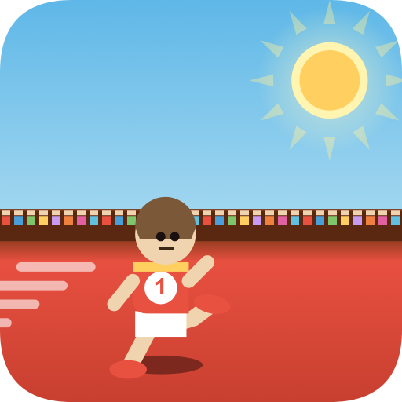
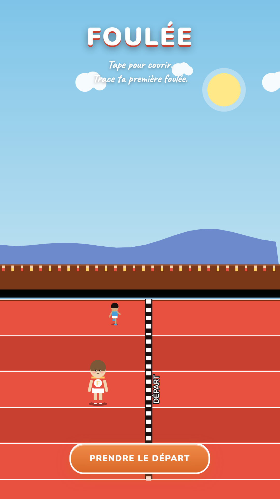
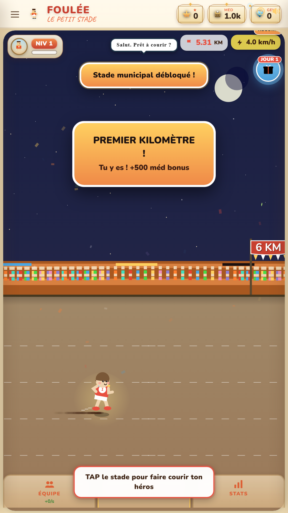
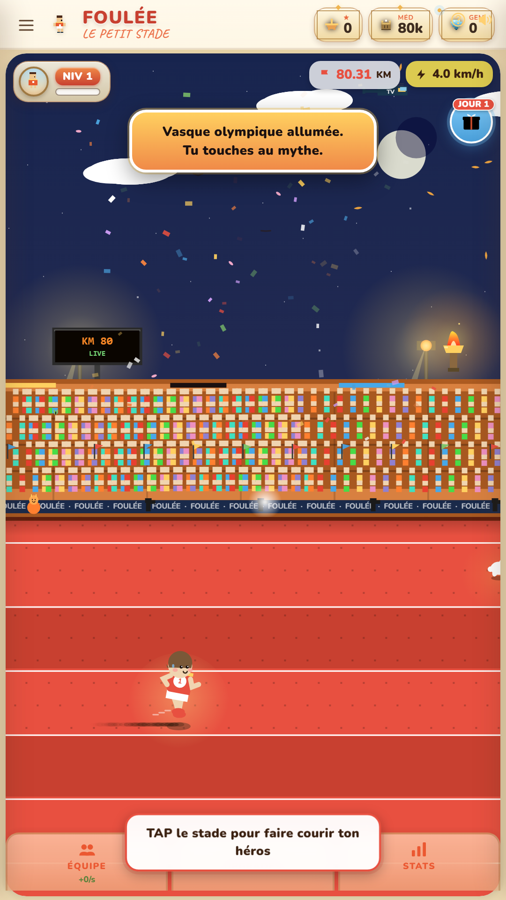
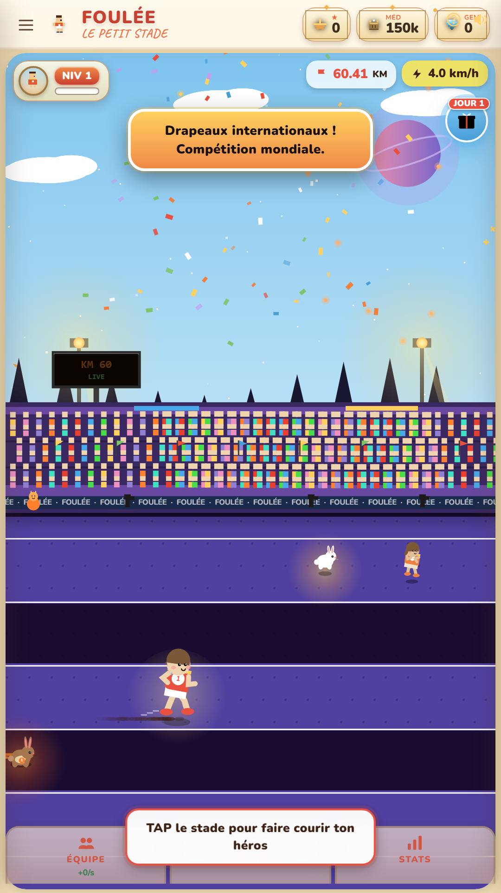
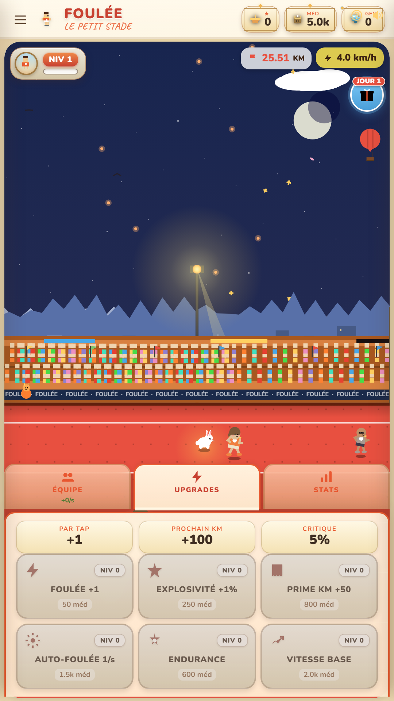
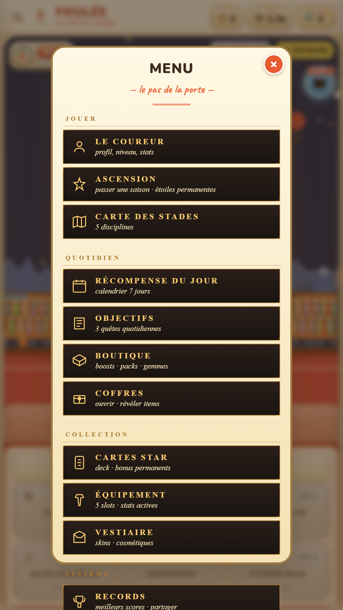
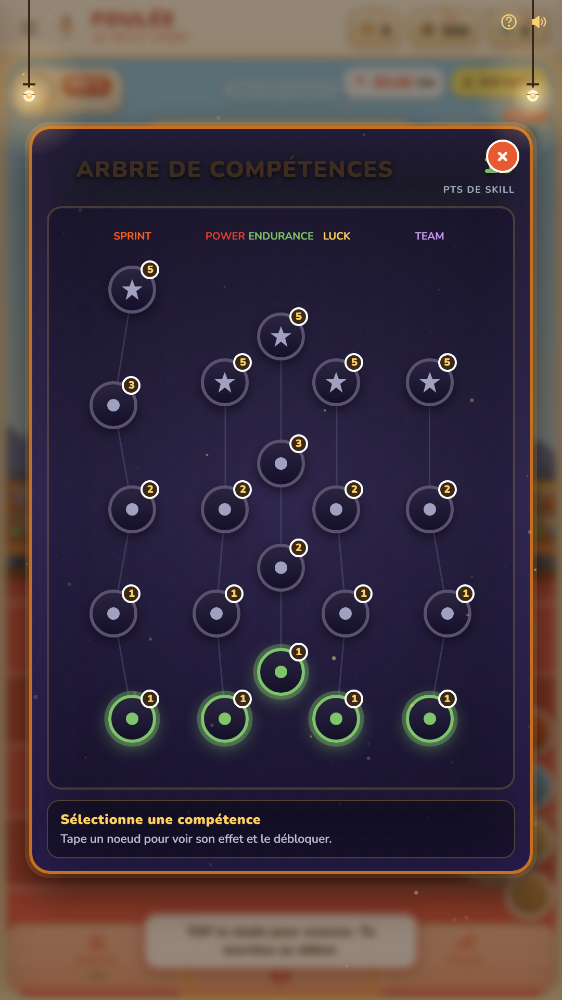
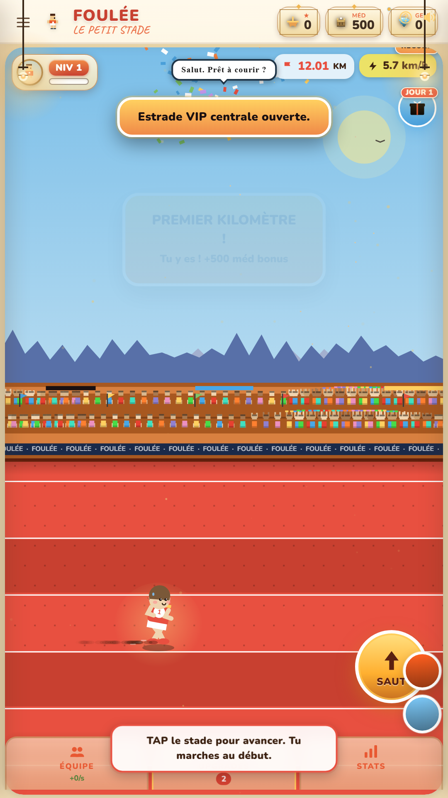

<div align="center">

# FOULÉE

**Du chantier au stade olympique**

*Idle-tap mobile : tape pour courir, saute les haies, deviens une légende.*



[]()
[]()
[]()
[]()

</div>

---

## Pitch

FOULÉE est un jeu idle-tap mobile-first où tu pars du chantier (km 0, wasteland) pour finir dans le stade olympique (km 100). Tape pour faire courir ton héros, saute les haies au bon moment, dépasse les rivals, traverse 5 biomes vivants (chantier → banlieue → ville → stade → lune), équipe des coffres, débloque 6 coureurs idle dans ton équipe, et utilise 4 skills actifs façon Clicker Heroes. À 100 km, ascends et recommence avec des étoiles permanentes.

---

## Screenshots

| Splash | Début de course | Stade olympique | Cosmic |
|---|---|---|---|
|  |  |  |  |

| Upgrades | Menu | Skill tree | Tribune |
|---|---|---|---|
|  |  |  |  |

---

## Lancer en local

```sh
python -m http.server 8770 --directory D:/alchimia
# Ouvre http://localhost:8770
```

Mode debug (expose hooks dev sur `window.RUNNER_2D`) :

```sh
# Option A : URL
http://localhost:8770/?debug=1

# Option B : localStorage
localStorage.setItem('fouleeDebug', '1')  # puis reload
```

---

## Déploiement

### PWA (GitHub Pages, Netlify, Vercel)

Le projet est un single-HTML statique. Pousse `index.html`, `manifest.json`, `sw.js`, `assets/`, `screenshots/` (si besoin) sur n'importe quel hébergeur statique. Tout fonctionne offline-first via le service worker (`cache: foulee-v5`).

### Play Store (TWA)

Le projet est packagé en **Trusted Web Activity** via Bubblewrap. La config est dans `twa-manifest.json`. Voir `LAUNCH-CHECKLIST.md` pour l'état production complet (assets store, légal, screenshots HD).

---

## Stack technique

- **HTML / CSS / JS vanilla** — zéro dépendance runtime, single-file 28 555 lignes
- **Canvas2D** pour le rendu pixel-art (5 biomes, parallax side-scroll, sprites héros + 7 tiers de NPCs)
- **Web Audio API** pour BGM procédurale (`ProcBGM` IIFE — kick/snare/hat/bass/pad/melody synthétisés en temps réel, 4 presets)
- **localStorage** + **IndexedDB** (CloudSave lite redondant)
- **Service Worker** offline-first (network-first HTML, cache-first assets)
- **Web Share API** + clipboard fallback pour export saves
- **Vibration API** mobile
- **PWA** installable (manifest + maskable icons + theme-color)
- **i18n** FR/EN avec auto-détection
- **No build step** — édite, recharge, ça marche

---

## Architecture

```
D:/alchimia/
├── index.html              ← 28k+ lignes : CSS + DOM + JS monolithique
├── manifest.json           ← PWA manifeste
├── sw.js                   ← Service worker (cache foulee-v5)
├── twa-manifest.json       ← Config TWA (Trusted Web Activity)
├── privacy-policy.html     ← RGPD / COPPA / Play Store
├── terms.html              ← CGU FR
├── CLAUDE.md               ← Guide codebase (agents IA)
├── README.md               ← Ce fichier
├── LAUNCH-CHECKLIST.md     ← État production Play Store
├── docs/
│   ├── ARCHITECTURE.md     ← Diagrammes + flows + patterns
│   ├── STATE-SCHEMA.md     ← Toutes les props STATE.*
│   └── FEATURES.md         ← Liste exhaustive features
├── assets/                 ← Icônes 192/512/1024 + maskable + audio
├── screenshots/            ← Captures gameplay + store
├── previews/               ← Itérations DA / mockups
└── marketing/              ← Assets feature graphic, description
```

---

## Documentation développeur

Si tu travailles sur le code, lis dans l'ordre :

1. **[CLAUDE.md](CLAUDE.md)** — conventions, pitfalls, comment ajouter une feature
2. **[docs/ARCHITECTURE.md](docs/ARCHITECTURE.md)** — diagrammes ASCII des composants, flow d'un tap, flow du save, patterns récurrents
3. **[docs/STATE-SCHEMA.md](docs/STATE-SCHEMA.md)** — exhaustif des 70+ propriétés `STATE.*`
4. **[docs/FEATURES.md](docs/FEATURES.md)** — liste de toutes les features avec localisation lignes

---

## License

Proprietary — © 2026 Florent Rouxel (Dryk). Tous droits réservés.

Le code source n'est ni open-source ni redistribuable. Le repo Git local sert d'archive de développement.
